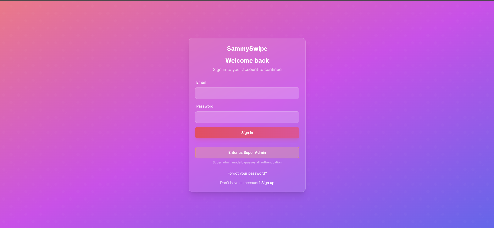
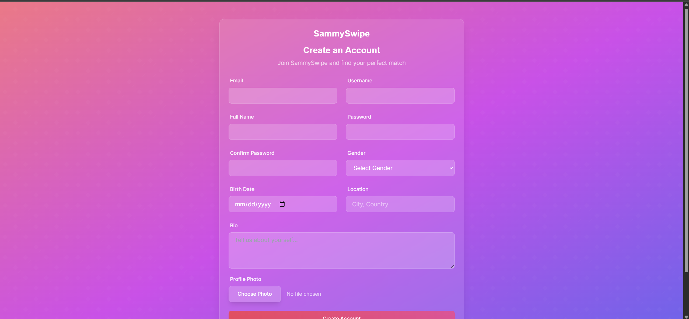
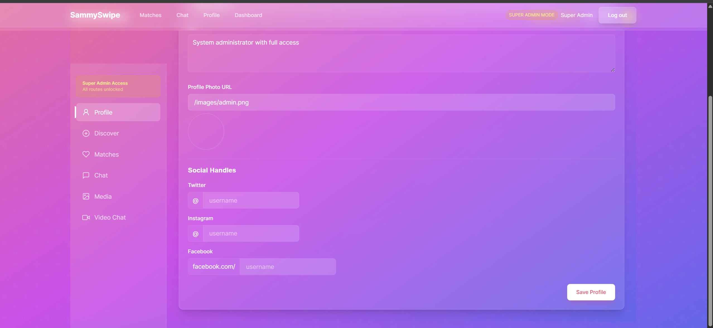
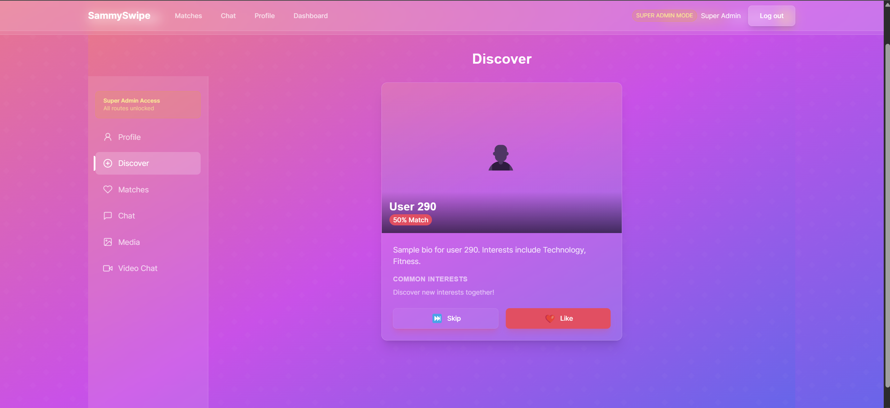

# SammySwipe - Advanced Dating App with Social Media Interest Analysis

A modern dating application that uses social media interest analysis and machine learning to provide intelligent matches.

## Features

- User registration and profile management
- Social media interest analysis
- ML-powered matching algorithm
- Real-time chat (TODO)
- Media sharing capabilities
- Video chat features (TODO)
- Graph-based relationship management

## Tech Stack

- Backend: FastAPI
- Frontend: Streamlit
- Database: Neo4j (Graph Database)
- ML Components: scikit-learn
- Authentication: JWT

## Setup Instructions

1. Install dependencies:
   ```bash
   pip install -r requirements.txt
   ```

2. Set up environment variables:
   Create a `.env` file with:
   ```
   NEO4J_URI=your_neo4j_uri
   NEO4J_USER=your_neo4j_user
   NEO4J_PASSWORD=your_neo4j_password
   JWT_SECRET_KEY=your_secret_key
   ```

3. Run the backend:
   ```bash
   uvicorn backend.main:app --reload
   ```

4. Run the frontend:
   ```bash
   cd frontend-react
   npm run dev
   ```

## Project Structure

```
.
├── backend/
│   ├── api/
│   ├── core/
│   ├── db/
│   ├── models/
│   └── services/
|___frontend (TODO: remove streamlit directly)
├── frontend-react/
│   ├── pages/
│   └── components/
├── ml/
│   ├── models/
│   └── pipeline/
└── tests/
```

## UI Demo

<!-- [video ](/SammySwipe.mp4) -->

<video width="640" height="360" controls>
  <source src="/SammySwipe.mp4" type="video/mp4">
  Your browser does not support the video tag.
</video>

## Contributing

Please read CONTRIBUTING.md for details on our code of conduct and the process for submitting pull requests.

## License

This project is licensed under the MIT License - see the LICENSE file for details.

## Realistic User Data Integration

The application now uses the RandomUser API (https://randomuser.me) to provide realistic user data throughout the system:

1. **Backend Integration**:
   - The Neo4j database can be populated with 1000+ realistic user profiles
   - Each user has realistic attributes: name, photo, location, interests, etc.
   - The matching algorithm uses these users to provide realistic recommendations

2. **Superuser Mode**:
   - Superuser can access all parts of the application without authentication
   - When in superuser mode, all API responses contain realistic user data from RandomUser API
   - The UI displays real names, photos, and profile information

## Database Population

To populate the Neo4j database with realistic user data:

```bash
# From the backend directory
cd backend
python -m scripts.populate_users
```

You can specify the number of users to generate:

```bash
python -m scripts.populate_users --count 500
```

## Superuser Access

To access the application as a superuser:

1. Go to the login page
2. Click "Enter as Super Admin"
3. You'll be logged in with full access to all features
4. The application will display "SUPER ADMIN MODE" in the header

## Configuration

The following environment variables control the behavior:

- `POPULATE_DB_ON_STARTUP`: Set to "True" to automatically populate the database on application startup (default: "True")
- `RANDOM_USER_COUNT`: Number of random users to fetch and store (default: 1000)

## Implementation Details

The integration with RandomUser API is implemented in:

- `backend/db/neo4j_client.py`: Functions to fetch and store random users
- `backend/api/matches.py`: Updated to use realistic recommendations
- `frontend-react/src/lib/api.ts`: Modified API interceptors for superuser mode

## Credits

This application uses data from the RandomUser API (https://randomuser.me), which provides randomly generated user data for testing and demonstration purposes.

## Docker Setup

The easiest way to run SammySwipe is using Docker:

### Prerequisites

- Docker and Docker Compose installed on your system

### Running with Docker

1. Clone the repository
   ```bash
   git clone https://github.com/yourusername/SammySwipe.git
   cd SammySwipe
   ```

2. Run the application
   ```bash
   ./run_docker.sh
   ```

3. If you need to manually populate the database with users:
   ```bash
   ./populate_db.sh
   ```

4. Access the application:
   - Frontend: http://localhost:3000
   - Backend API: http://localhost:8000/docs
   - Neo4j Database: http://localhost:7474/browser/ (username: neo4j, password: sammyswipe_password)

5. To stop the application:
   ```bash
   docker-compose down
   ```

### Superuser Mode

To access all routes without authentication, toggle the superuser mode on the login page. 

## Screenshots

Here are some screenshots of the SammySwipe application:


*The main page for the application*


*The login page allows users to sign in or access superuser mode.*


*The login page allows users to sign up or access superuser mode.*


*View and edit user profiles with detailed information.*


*Discover intelligent matches based on social media interests.*


*Find intelligent matches based on preferences*


*Real-time chat interface for seamless communication.*